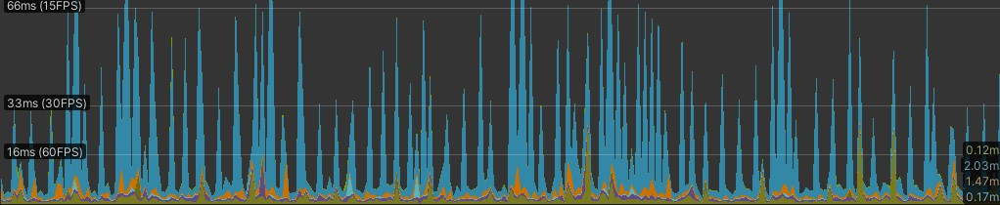
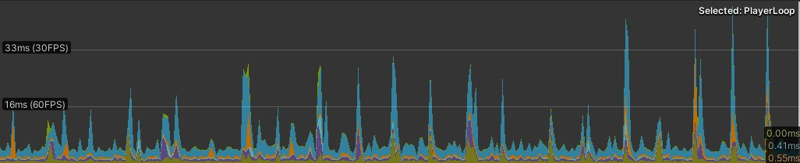

Comparing how cpu usage for different methods

## Summary
```
...     NetworkTransform (v26)
...     NetworkTransform (master)
...     NetworkTransform (Position only)
...     Positions System (uncompressed)
...     Positions System (compressed)
...     Positions+rotation System (compressed)
```


## Initial testing

System seems to easily outperform NetworkTransform


*Telepathy with NetworkTransformPositionOnly*


*Telepathy with NetworkTransformSystem*

NetworkTransform has many spikes over 66ms, System has few spikes over 33ms but the average seems to be well below 33ms